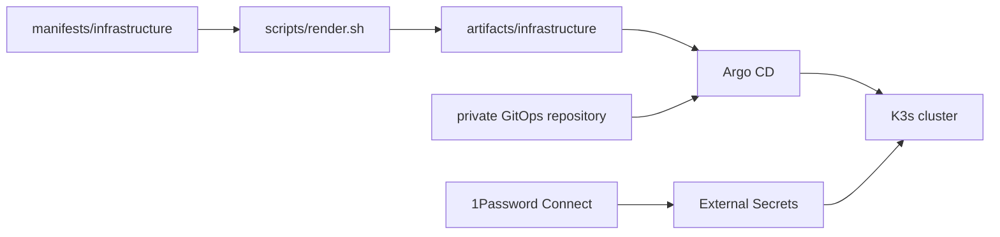

# Homelab public GitOps

This repository is the public, reproducible half of a Kubernetes homelab. It declares infrastructure with Kustomize, renders the declarations into committed artifacts, and lets Argo CD reconcile that desired state in the cluster. Private applications and credential material remain outside this repository.

## System model



The infrastructure root creates Argo CD Applications for Argo CD, Cilium, External Secrets, 1Password Connect, Istio, cert-manager, Longhorn, CloudNativePG, Grafana, MetalLB, namespaces, and the private repository boundary. Bootstrap brings up the networking and GitOps prerequisites before Argo CD owns steady-state reconciliation.

## Repository layout

| Path | Purpose |
| --- | --- |
| `manifests/infrastructure/` | Kustomize source for public cluster infrastructure. |
| `artifacts/infrastructure/` | Committed, rendered Kubernetes manifests consumed by GitOps. Do not edit manually. |
| `scripts/render.sh` | Renders selected or changed Kustomize sources into `artifacts/`. |
| `scripts/validate.sh` | Local validation: actionlint, shellcheck, render, and kubeconform. |
| `scripts/bootstrap.sh` | Legacy live-cluster bootstrap helper. It needs local credentials and mutates a cluster. |
| `ansible/` | K3s node provisioning, upgrades, recovery, and GitOps bootstrap playbooks. |
| `docs/operations-runbook.md` | Guard-railed operating procedures and explicit operational placeholders. |
| `tasks/` | Path-owned work contracts for concurrent agents. |
| `AGENTS.md` | Repository agent protocol and safety gates. |
| `skills/contribution-workflow/` | Required Conventional Commit and pull-request workflow. |

## Local validation

Install the pinned Hermit tools, then validate in a worktree:

```bash
source bin/activate-hermit
./scripts/validate.sh
```

Validation renders infrastructure and rewrites `artifacts/` locally. It does not apply anything to a cluster. Review and commit any intended generated changes with their source change.

## Operations

The [operations runbook](docs/operations-runbook.md) covers guarded paths for K3s upgrades, GitOps bootstrap, and secret rotation. These procedures are deliberately not routine developer commands: they require approved maintenance windows, private inventory or credential manifests, and explicit authorization before they can mutate live infrastructure.

## Contribution

Read `AGENTS.md` before making changes. Every change follows `skills/contribution-workflow/SKILL.md`: verify the scoped behavior, create a Conventional Commit, push a branch, and land through a pull request with Summary, Validation, Risk and rollout, and Follow-ups.
